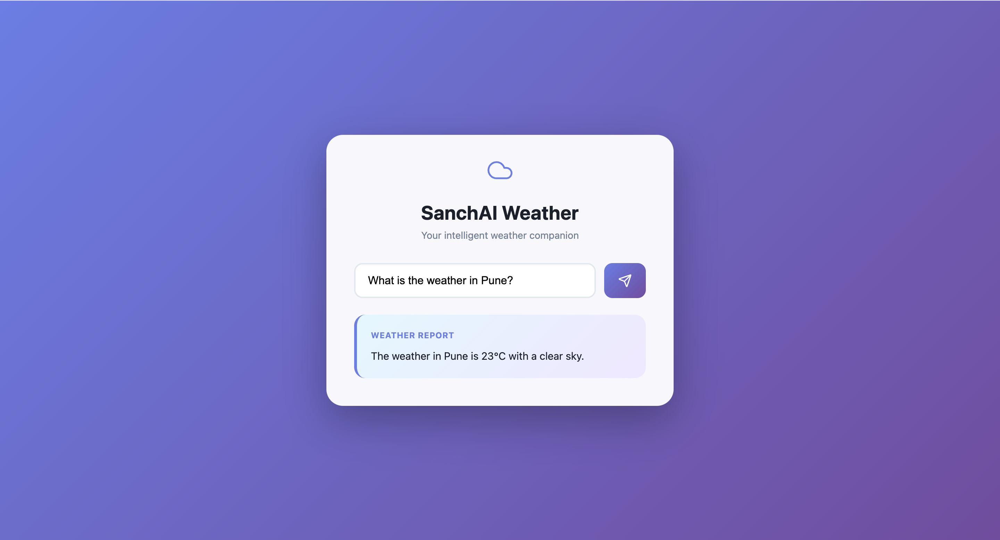
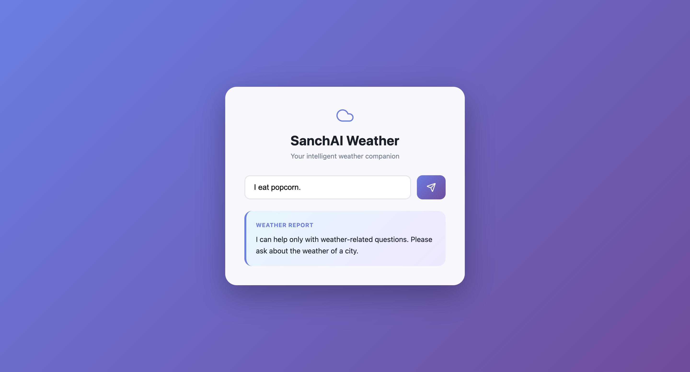

# SanchAI Weather Assistant

A minimal full-stack weather assistant built as part of the **SanchAI Analytics Internship Tech Assessment**.

The application allows users to ask weather-related questions in natural language.  
The backend uses **FastAPI + LangChain + OpenRouter (LLM)** to determine when to call a weather tool and respond intelligently.

---

## Features

- React-based frontend (Vite)
- FastAPI backend
- LangChain agent with tool calling
- OpenRouter LLM integration
- Weather lookup using external API
- Intent detection to avoid unnecessary LLM calls
- Clean and minimal UI
- Postman and frontend tested

---

## Tech Stack

### Frontend
- React (Vite)
- JavaScript
- CSS

### Backend
- Python 3.11
- FastAPI
- LangChain
- OpenRouter
- Uvicorn

---

## Project Structure

```text

Weather_App/
│
├── backend/
│   ├── app/
│   │   ├── main.py        # FastAPI entry point
│   │   ├── agent.py       # LangChain agent logic
│   │   ├── tools.py       # Weather tool integration
│   │   ├── schemas.py    # Request/response schemas
│   │   └── config.py     # Environment & config loader
│   │
│   ├── requirements.txt  # Backend dependencies
│   └── .env              # Environment variables (not committed)
│
├── frontend/
│   ├── src/
│   │   ├── App.jsx       # Main React component
│   │   ├── App.css       # Styling for App component
│   │   ├── api.js        # Backend API calls
│   │   └── main.jsx      # React entry point
│   │
│   └── package.json      # Frontend dependencies
│
└── README.md             # Project documentation

```


## Backend Setup

### 1. Create virtual environment

```bash
cd backend
python3.11 -m venv venv
source venv/bin/activate
```

### 2. Install dependencies
```bash
pip install -r requirements.txt
```
### 3. Configure environment variables

## Create .env file inside backend/:
```bash
   OPENROUTER_API_KEY=your_openrouter_api_key
   OPENROUTER_MODEL=openai/gpt-4o-mini
   WEATHER_API_KEY=your_weather_api
   
```

### 4. Run backend
```bash
python -m uvicorn app.main:app
```

## Backend runs at:
[http://127.0.0.1:8000](http://127.0.0.1:8000)

## Frontend Setup

```bash
cd frontend
npm install
npm run dev
```

## Frontend runs at:

[http://localhost:5173](http://localhost:5173)

## Screenshots

### Weather Query – Valid Input
This example shows a successful weather-related query handled by the assistant.



---

### Non-Weather Input Handling
This example shows how the system gracefully handles non-weather-related queries.


